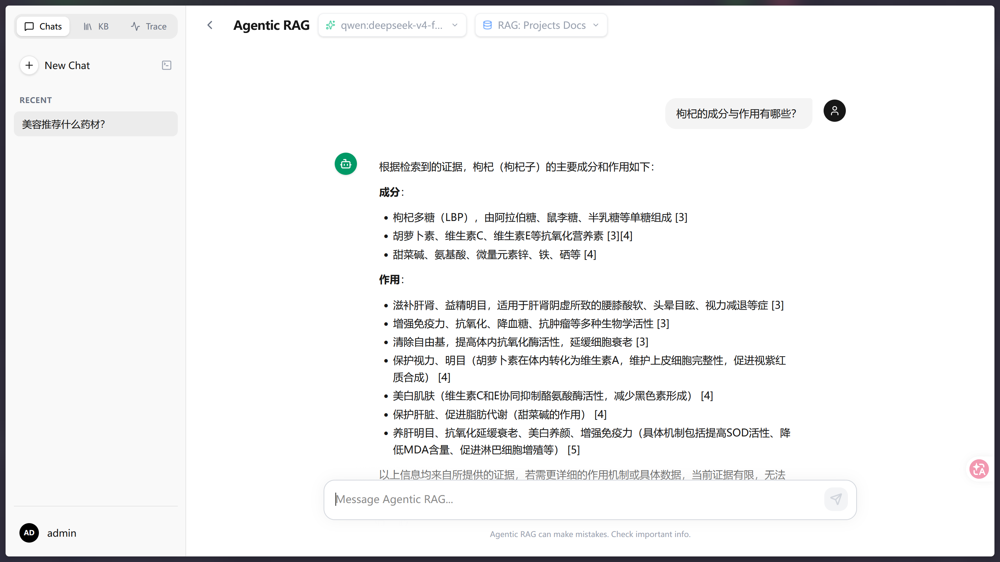
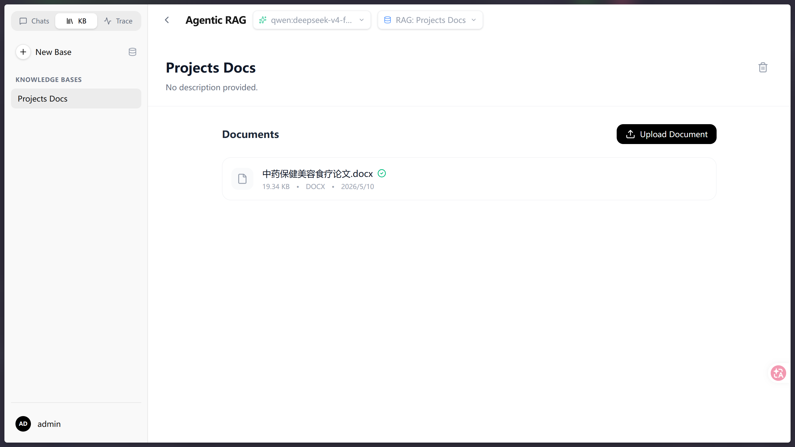
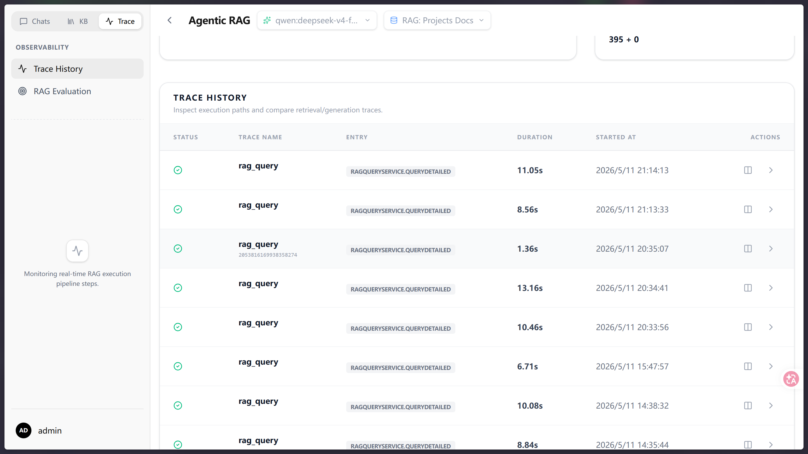
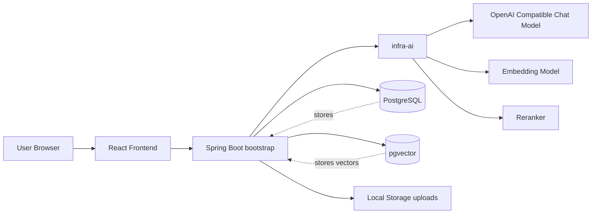
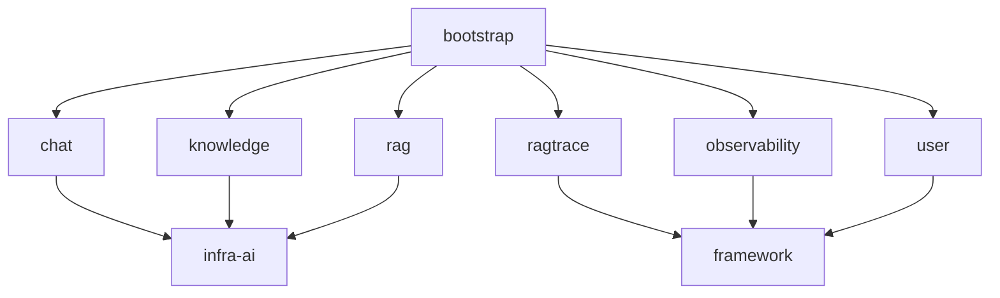
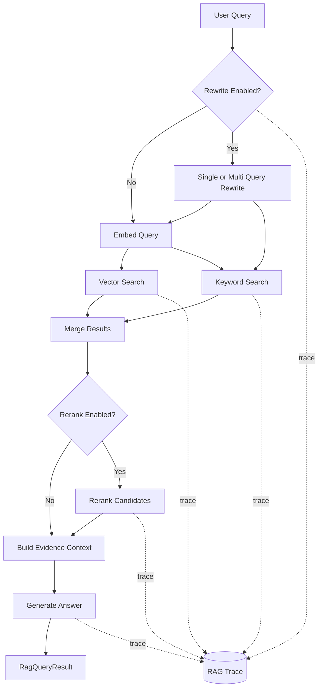
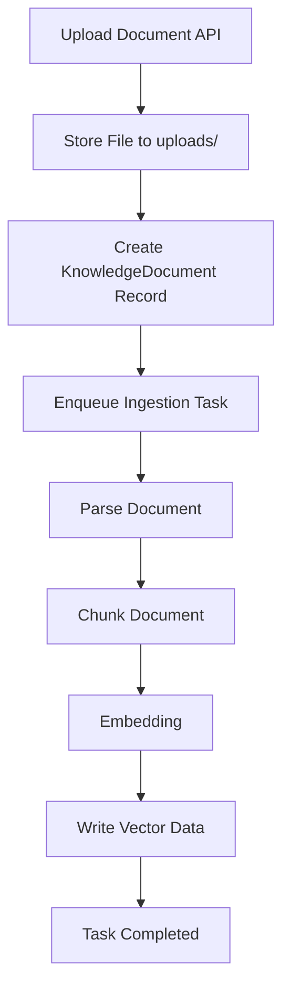
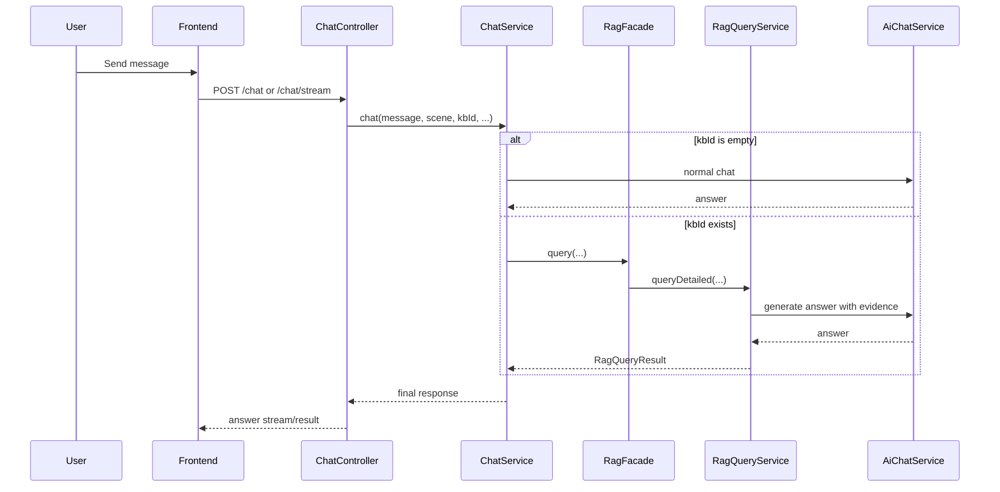

# AgenticRAG

基于 Spring Boot、Spring AI、PostgreSQL/pgvector 和 React 的智能文档问答项目。

项目目标是提供一条可扩展的 RAG 链路，覆盖知识库管理、文档解析与入库、混合检索、重排、链路追踪、质量观测和评测能力。



## 功能概览

- 用户注册、登录、JWT 鉴权、刷新令牌
- 多会话聊天与会话标题管理
- 用户级 AI 提供商配置与模型切换
- 知识库创建、文档上传、异步解析与入库
- RAG 问答
- 混合检索：向量检索 + 关键词检索
- Query Rewrite / Multi-Query Rewrite
- Rerank 重排
- RAG Trace 链路记录
- RAG Observability 指标、告警、摘要
- RAG Eval 评测脚本与对比脚本

**知识库上传:**


**历史追踪:**


## 技术栈

后端：

- Java 17
- Spring Boot 3.4
- Spring AI 1.1.6
- MyBatis-Plus
- PostgreSQL
- pgvector
- Reactor

前端：

- React 19
- TypeScript
- Vite
- Tailwind CSS 4
- Axios

文档解析：

- PDFBox
- Apache POI
- CommonMark

## 项目结构

```text
agenticrag/
├─ bootstrap/    # Spring Boot 启动模块，业务接口、RAG、知识库、鉴权、观测
├─ infra-ai/     # AI 基础设施抽象，聊天、Embedding、模型路由、记忆、配置
├─ framework/    # 公共框架模块
├─ frontend/     # React 前端
├─ resources/    # 数据库脚本
├─ scripts/      # RAG 评测和对比脚本
└─ uploads/      # 本地文档存储目录
```

## 系统架构图

### 总体架构



### 后端模块关系



## 架构说明

### 1. 模块职责

- `bootstrap`
  - 暴露 REST API
  - 实现知识库管理、文档处理、RAG 查询、Trace、Observability
- `infra-ai`
  - 对 Spring AI 做一层项目内抽象
  - 提供 `AiChatService`、`AiEmbeddingFacade`、模型路由、会话记忆
- `frontend`
  - 提供聊天、知识库、评测和观测页面

### 2. RAG 链路

当前项目的 RAG 主流程是业务层显式编排，不是完全依赖 Spring AI 内置 Advisor：

1. 查询改写
2. Embedding
3. 向量检索
4. 关键词检索
5. 融合排序
6. Rerank
7. 组装证据上下文
8. 调用聊天模型生成答案
9. 写入 Trace 和观测指标


### 4. RAG 查询链路图



### 3. Spring AI 的使用边界

项目使用了 Spring AI 作为模型调用底座，但没有把整个 RAG 编排交给 Advisor。

当前已使用的典型能力：

- `ChatClient`
- `MessageChatMemoryAdvisor`
- `OpenAI` 兼容模型接入

## 核心能力细节

### 知识库与入库

支持创建知识库、上传文档、异步处理文档并写入向量索引。

支持的文档类型来自当前解析器实现：

- `pdf`
- `docx` / Word
- `md`
- `txt`

### 文档入库链路图



### 聊天与 RAG 入口关系



### 混合检索

当前默认开启混合检索：

- 向量召回
- 关键词召回
- 按权重融合
- 相似度阈值过滤

### Query Rewrite

当前支持：

- 单查询改写
- Multi-Query Rewrite

用于提升复杂问句、多表达方式问句的召回稳定性。

### Rerank

检索结果在进入生成前会进行重排，避免低质量 chunk 干扰答案生成。

### Trace 与观测

项目为 RAG 查询单独记录链路和统计信息，便于分析：

- rewrite
- retrieve
- rerank
- generate
- token/cost 估算
- 空召回、拒答、错误率

## 环境要求

- JDK 17
- Maven 3.9+
- Node.js 20+
- PostgreSQL 14+，并启用 `pgvector`

## 快速启动

### 1. 初始化数据库

先创建 PostgreSQL 数据库，并执行：

- [scheme.sql](/D:/CodeAndProjects/agenticrag/resources/databases/scheme.sql:1)
- [init.sql](/D:/CodeAndProjects/agenticrag/resources/databases/init.sql:1)

`scheme.sql` 中包含：

- 业务表
- RAG trace 表
- RAG eval 表
- 向量表
- `CREATE EXTENSION IF NOT EXISTS vector`

### 2. 配置环境变量

后端至少需要以下环境变量：

```bash
DB_URL=jdbc:postgresql://localhost:5432/agenticrag
DB_USERNAME=postgres
DB_PASSWORD=postgres

BASE_URL=https://your-openai-compatible-endpoint
API_KEY=your-api-key

JWT_SECRET=replace-with-a-long-random-secret
```

推荐同时显式配置：

```bash
OPENAI_BASE_URL=https://your-openai-compatible-endpoint
OPENAI_API_KEY=your-api-key
OPENAI_CHAT_MODEL=deepseek-v4-flash
OPENAI_EMBEDDING_MODEL=text-embedding-3-small

EMBEDDING_PROVIDER=qwen
EMBEDDING_BASE_URL=https://dashscope.aliyuncs.com/compatible-mode
EMBEDDING_API_KEY=your-embedding-api-key
EMBEDDING_MODEL=text-embedding-v3

RAG_ALERT_WEBHOOK_URL=
JWT_ACCESS_EXPIRE_SECONDS=7200
JWT_REFRESH_EXPIRE_SECONDS=604800
```

### 3. 启动后端

在项目根目录执行：

```bash
./mvnw spring-boot:run -pl bootstrap
```

Windows：

```powershell
.\mvnw.cmd spring-boot:run -pl bootstrap
```

默认服务地址：

```text
http://localhost:8080
```

### 4. 启动前端

```bash
cd frontend
npm install
npm run dev
```

默认前端地址通常为：

```text
http://localhost:5173
```

## 主要接口

以下是当前代码中已确认的主要接口分组。

### 用户与鉴权

控制器：

- [UserController.java](/D:/CodeAndProjects/agenticrag/bootstrap/src/main/java/com/agenticrag/user/controller/UserController.java:1)

主要接口：

- `POST /user/register`
- `POST /user/login`
- `POST /user/refresh`
- `POST /user/logout`
- `POST /user/password/update`
- `GET /user/info`
- `GET /user/list`
- `DELETE /user/{id}`

### 用户 AI 设置

控制器：

- [UserAiSettingsController.java](/D:/CodeAndProjects/agenticrag/bootstrap/src/main/java/com/agenticrag/user/controller/UserAiSettingsController.java:1)

主要接口：

- `GET /user/ai-settings`
- `GET /user/ai-settings/options`
- `POST /user/ai-settings/verify`
- `POST /user/ai-settings/save`
- `POST /user/ai-settings/switch`
- `DELETE /user/ai-settings`

### 聊天

控制器：

- [ChatController.java](/D:/CodeAndProjects/agenticrag/bootstrap/src/main/java/com/agenticrag/chat/controller/ChatController.java:1)

主要接口：

- `GET /chat/sessions`
- `GET /chat/messages`
- `PUT /chat/session/{conversationId}/title`
- `POST /chat/session/new`
- `DELETE /chat/session/{sessionId}`
- `POST /chat`
- `POST /chat/stream`

### 知识库

控制器：

- [KnowledgeBaseController.java](/D:/CodeAndProjects/agenticrag/bootstrap/src/main/java/com/agenticrag/knowledge/controller/KnowledgeBaseController.java:1)

主要接口：

- `POST /api/knowledge-base`
- `GET /api/knowledge-base`
- `GET /api/knowledge-base/{id}`
- `DELETE /api/knowledge-base/{id}`
- `POST /api/knowledge-base/{kbId}/documents`
- `GET /api/knowledge-base/{kbId}/documents`
- `DELETE /api/knowledge-base/documents/{docId}`
- `POST /api/knowledge-base/documents/{docId}/process`
- `GET /api/knowledge-base/documents/{docId}/tasks`

### RAG 查询

控制器：

- [RagController.java](/D:/CodeAndProjects/agenticrag/bootstrap/src/main/java/com/agenticrag/knowledge/controller/RagController.java:1)

主要接口：

- `POST /api/rag/query`

示例请求：

```json
{
  "query": "这个项目的 RAG 链路怎么做的？",
  "kbId": "2053404052797214721",
  "topK": 5
}
```

### Embedding

控制器：

- [EmbeddingController.java](/D:/CodeAndProjects/agenticrag/bootstrap/src/main/java/com/agenticrag/infrastructure/embedding/controller/EmbeddingController.java:1)

主要接口：

- `POST /embedding?text=hello`

### RAG Trace

控制器：

- [RagTraceController.java](/D:/CodeAndProjects/agenticrag/bootstrap/src/main/java/com/agenticrag/ragtrace/controller/RagTraceController.java:1)

主要接口：

- `GET /api/rag/traces`
- `GET /api/rag/traces/{traceId}`

### RAG Observability

控制器：

- [RagObservabilityController.java](/D:/CodeAndProjects/agenticrag/bootstrap/src/main/java/com/agenticrag/observability/controller/RagObservabilityController.java:1)

主要接口：

- `GET /api/rag/observability/metrics`
- `GET /api/rag/observability/alerts`
- `GET /api/rag/observability/summary`
- `POST /api/rag/observability/alerts/dispatch`

### RAG Eval

仓库内已包含评测脚本，并可确认以下接口被使用：

- `POST /api/rag/evals/run`
- `GET /api/rag/evals/compare`

脚本位置：

- [run-rag-eval.ps1](/D:/CodeAndProjects/agenticrag/scripts/run-rag-eval.ps1:1)
- [compare-rag-eval.ps1](/D:/CodeAndProjects/agenticrag/scripts/compare-rag-eval.ps1:1)

## RAG 评测脚本

运行评测：

```powershell
.\scripts\run-rag-eval.ps1 `
  -BaseUrl "http://localhost:8080" `
  -Dataset "sample-template" `
  -KbId "your-kb-id" `
  -Username "admin" `
  -Password "123456"
```

对比两次评测：

```powershell
.\scripts\compare-rag-eval.ps1 `
  -BaseUrl "http://localhost:8080" `
  -BaseRunId "run-a" `
  -TargetRunId "run-b" `
  -Username "admin" `
  -Password "123456"
```

评测报告默认输出到：

```text
artifacts/rag-eval/
```

## 当前默认配置

从当前 `application.yml` 可以确认的默认行为：

- 默认聊天模型：`deepseek-v4-flash`
- 默认 Embedding 模型：`text-embedding-3-small`
- RAG 默认 `topK=5`
- 向量检索 `vectorTopK=12`
- 关键词检索 `keywordTopK=8`
- 相似度阈值 `0.55`
- 混合检索开启
- Rewrite 开启
- Rerank 开启
- 最大上下文块数 `6`

## 文件存储

当前文档上传走本地存储适配器，上传目录可见：

- `uploads/`

这意味着在本地开发环境中，需要保证应用进程对该目录有读写权限。

## 适合继续完善的方向

- 补充 `.env.example`
- 补充 Docker Compose，统一启动 PostgreSQL + pgvector + 后端 + 前端
- 补充 OpenAPI/Swagger 文档
- 明确前端开发环境代理配置
- 为 README 增加系统截图
- 增加生产部署说明

## 说明

本项目保留了对 Spring AI 的使用，但将 RAG 的核心编排逻辑放在业务层，以便更好地控制检索策略、可观测性和评测流程。
